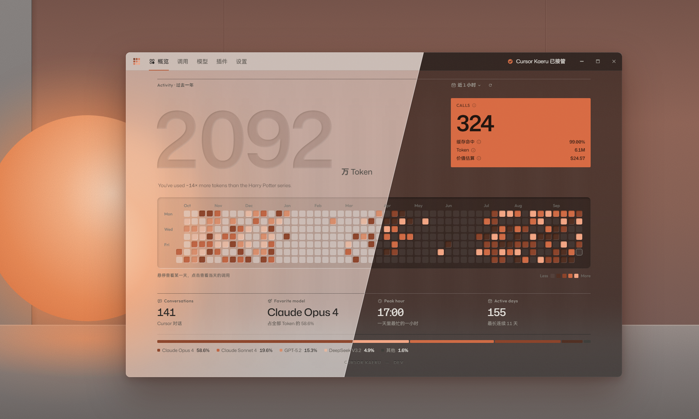

# Cursor Kaeru

在本机运行的 Cursor 模型网关：可用于转发 Cursor Agent 的请求，兼容 OpenAI / Anthropic API，并保留工具调用、Skills、MCP 和多轮对话。

本项目是 [cursor-byok](https://github.com/leookun/cursor-byok)（MIT）的个人改版，与 Cursor 及其开发者无关。感谢 cursor-byok 的项目维护者。



## 与上游的差异

协议解析、工具调用、Skills / MCP、多轮对话与调用记录等核心能力均来自上游，行为未作修改。差异集中在界面与配置方式：

- **界面**：12 栏网格版式；Windows 下使用系统亚克力材质；深色、浅色两套主题。
- **概览**：过去一年的 Token 总量、贡献墙、对话数、最常用模型、最忙时段及各模型 Token 占比。
- **模型配置**：改为“服务商 → 模型”两级结构。地址、API Key、协议和 Headers 归属服务商，其下模型共用；支持从服务商的模型列表批量添加。常见服务商按名称、地址或模型 ID 自动匹配单色 logo。
- **接管开关**：移至顶栏。
- **调用详情**：在应用内打开。
- **插件**：OAuth 账号显示额度（Antigravity 含每周额度）。
- **其他**：移除广告、推广接口与自动更新；按本机时区统计。

## 下载

在 [Releases](../../releases) 下载 Windows 安装包。应用不会自动更新，新版本需手动下载覆盖安装。

> **升级说明**：本版本包含一次数据库结构迁移，原有模型配置会按连接信息（协议、地址、API Key、Headers）合并为服务商。模型标识保持不变，Cursor 中已选择的模型与调用历史不受影响。迁移不可逆，升级前建议备份 `~/.cursor-byok-v3/cursor-byok.db`。

## 使用

1. 打开应用，进入 **模型**，按提示初始化本地 CA。
2. 点击 **添加服务商**，选择预设或填写服务器地址与 API Key；保存后从模型列表中勾选需要的模型，或在服务商一行点击 **添加** 手动填写。
3. 点击模型右侧的 **测试**，通过后在顶栏开启接管。
4. 保持应用运行，完全退出并重启 Cursor，新建对话，在模型列表中手动选择模型（不要选择 Auto）。

### 协议选择

| 模型系列 | 请求协议 |
| --- | --- |
| Claude | Anthropic Messages |
| GPT / OpenAI | OpenAI Responses |
| 其他 | OpenAI Chat Completions |

GPT 系列建议使用 Responses API；Chat Completions 可能无法利用提示词缓存。协议在服务商级别设置。

### 字段说明

- **服务器地址**：填写基础地址时按协议追加标准端点；勾选“使用完整请求地址”后原样使用。
- **模型名称**：服务商接受的模型标识，可通过 **获取模型列表** 读取。
- **显示名称**：仅影响 Cursor 模型列表中的名称；服务商名称作为徽章显示在模型旁。
- **自定义 Headers / 额外参数**：须为 JSON 对象，只填写服务商明确支持的字段。

### TAB 补全

TAB 补全使用独立服务，在 **设置 → TAB 设置** 中选择：公益服务（由上游作者部署，补全内容会发送至该服务器）、直连 Cursor 官方，或自建服务。

### 与官方账号并存

可正常登录 Cursor 账号。有官方额度时，官方模型与本地模型可混用；Auto 仅使用官方模型。

## 数据流

```text
Cursor ──Agent 请求 / 工具结果──▶ Cursor Kaeru（本机）──OpenAI / Anthropic 请求──▶ 模型服务
                                     │
                                     └─ SQLite：服务商与模型配置、API Key、对话与调用记录（仅本机）
```

## 开发

依赖：Rust、Node.js 22 + pnpm、Tauri 2 系统依赖。

```bash
pnpm --dir apps/desktop install
```

```bash
make dev-desktop     # 启动桌面应用
make dev-web         # 仅启动前端与本地服务
make check           # fmt + clippy + 测试 + 前端类型检查与构建
make build-desktop   # 打包（Windows 为 NSIS 安装包）
```

无 `make` 的 Windows 环境：

```bash
pnpm --dir apps/desktop exec tauri build --bundles nsis
```

界面演示（模拟数据，无需后端）：

```bash
pnpm --dir apps/desktop exec vite --config vite.demo.config.ts
```

访问 `/product-demo/demo/index.html`，可附加 `?platform=windows`、`?theme=default-light`。

新增中文界面文字后，重新生成中文字体子集（从系统字体目录读取 HarmonyOS Sans SC）：

```bash
pnpm --dir apps/desktop run fonts:cjk
```

修改服务商 logo 列表后重新生成：

```bash
pnpm --dir apps/desktop run logos:providers
```

## 许可证

MIT，见 [LICENSE](./LICENSE)。服务商 logo 取自 [Simple Icons](https://simpleicons.org)（CC0）与 [theSVG](https://thesvg.org)（MIT）。
